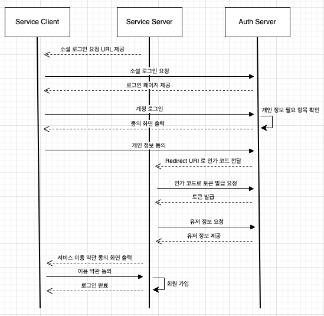

## 소셜 로그인 프로세스

1. ( 네이버 | 카카오 | 구글 ) 계정으로 로그인을 요청합니다.
2. 인증 서버는 클라이언트(Service Server) 확인 후, 로그인 페이지를 제공합니다.
3. 계정을 로그인하면 프로필 정보, 이메일 등의 사용자 동의를 요청합니다.
5. 사용자가 동의하면 인증 서버는 인가 코드를 발급합니다.
6. 인가 코드를 이용하여 액세스 토큰을 요청합니다.
7. 액세스 토큰으로 사용자 정보를 조회합니다.
8. 서비스 이용 약관에 동의하면 가입 처리 및 로그인이 완료됩니다.

 

### 참고 자료
- https://developers.naver.com/docs/login/api/api.md
- https://developers.kakao.com/docs/latest/ko/kakaologin/rest-api
- https://developers.google.com/identity/protocols/oauth2/web-server?hl=ko#httprest
